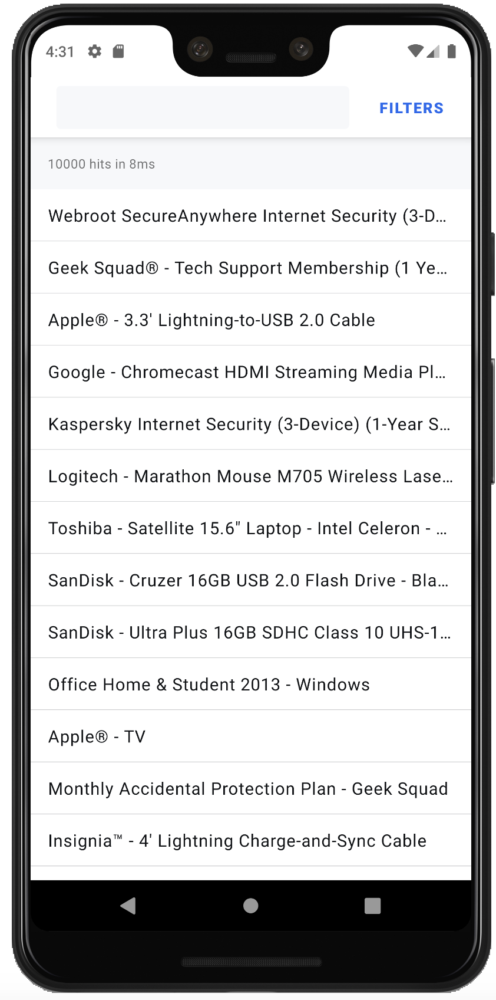

# Android Coding Challenge

Create a full search experience from scratch using the Github API
https://developer.github.com/v3/search/#search-repositories

This search experience will include:

- A list to display search results
    - Display search results in a RecyclerView
- A searchbox to type your query
    - This should be display results as the user types in text
    - Most popular repositories appear first in the search results.
- Statistics about the current search
    - Number of Repositories found
- A facet list for filtering results
    - Filter by topic/language

 Preferred Language is Kotlin.

 Extra Points for
  - Tests
  - Following an Architectural Pattern e.g. MVVM/MVP
  - Dependency Injection
  - infinite scrolling mechanism
  
  